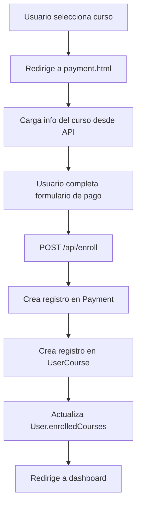
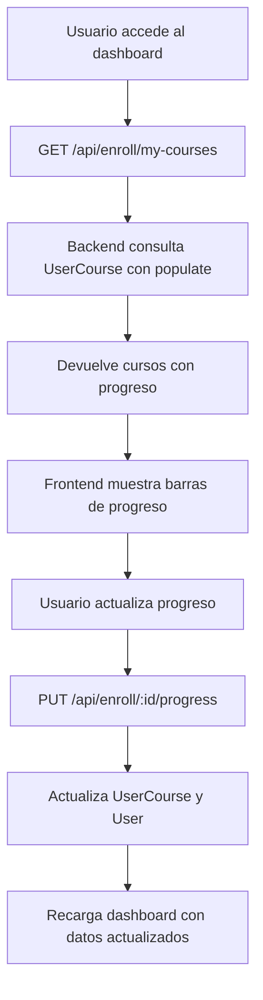

# Flujo Completo de Inscripción y Progreso - Elim Online

## Resumen del Sistema Implementado

Se ha implementado un sistema completo de inscripción a cursos con pago simulado y seguimiento de progreso, que incluye:

### ✅ **Backend - Nuevos Modelos y Endpoints**

#### **Modelos Creados:**
1. **Payment** - Para pagos simulados
2. **UserCourse** - Para vincular usuarios con cursos y su progreso
3. **Course** - Actualizado con campos de precio y metadatos

#### **Endpoints Implementados:**
- `POST /api/enroll` - Inscribir usuario en curso (con pago simulado)
- `GET /api/enroll/my-courses` - Obtener cursos inscritos del usuario
- `GET /api/enroll/:id` - Obtener detalles de un curso específico
- `PUT /api/enroll/:id/progress` - Actualizar progreso de un curso

### ✅ **Frontend - Flujo Completo de Usuario**

#### **1. Landing Page → Selección de Curso**
- Usuario ve cursos disponibles desde la base de datos
- Puede registrarse o iniciar sesión
- Al hacer clic en "Adquirir Curso" → redirige a página de pago

#### **2. Página de Pago (payment.html)**
- Carga información del curso desde la API
- Formulario de pago simulado con validaciones
- Al completar pago → crea registro en Payment y UserCourse
- Redirige automáticamente al dashboard

#### **3. Dashboard del Usuario**
- Muestra cursos inscritos con progreso real
- Barras de progreso visuales
- Botones para continuar curso o actualizar progreso
- Estadísticas de lecciones completadas

## Flujo Detallado de Datos

### **1. Inscripción en Curso**



### **2. Seguimiento de Progreso**



## Estructura de Datos

### **Payment (Pago Simulado)**
```javascript
{
  userId: ObjectId,
  courseId: ObjectId,
  amount: Number,
  currency: String,
  status: "completed", // Siempre exitoso
  paymentMethod: "simulated",
  transactionId: String,
  cardLastFour: String,
  cardBrand: "simulated"
}
```

### **UserCourse (Inscripción y Progreso)**
```javascript
{
  userId: ObjectId,
  courseId: ObjectId,
  status: "active" | "completed" | "paused" | "cancelled",
  progress: Number, // 0-100
  enrolledAt: Date,
  completedAt: Date,
  lastAccessed: Date,
  paymentStatus: "paid",
  totalLessons: Number,
  completedLessons: Number,
  notes: String,
  rating: Number,
  review: String
}
```

### **Course (Actualizado)**
```javascript
{
  title: String,
  description: String,
  duration: String,
  lessons: Number,
  rating: Number,
  image: String,
  price: Number,
  currency: String,
  isActive: Boolean,
  category: String,
  level: String,
  instructor: String,
  totalHours: Number
}
```

## Endpoints Detallados

### **POST /api/enroll**
**Body:**
```json
{
  "courseId": "curso-adultos",
  "paymentData": {
    "cardNumber": "1234567890123456",
    "cardName": "Juan Pérez",
    "expiry": "12/25",
    "cvv": "123"
  }
}
```

**Response:**
```json
{
  "message": "Inscripción exitosa",
  "enrollment": {
    "id": "enrollment_id",
    "course": { /* datos del curso */ },
    "progress": 0,
    "status": "active",
    "enrolledAt": "2025-01-27T10:30:00Z"
  },
  "payment": {
    "id": "payment_id",
    "transactionId": "SIM_1234567890_abc123",
    "amount": 49.99,
    "status": "completed"
  }
}
```

### **GET /api/enroll/my-courses**
**Response:**
```json
{
  "message": "Cursos obtenidos exitosamente",
  "courses": [
    {
      "id": "enrollment_id",
      "course": {
        "id": "course_id",
        "title": "Gestión del Estrés para Adultos",
        "description": "...",
        "image": "/images/curso-adultos-estres.jpeg",
        "price": 49.99,
        "currency": "USD",
        "duration": "6 semanas",
        "lessons": 18,
        "rating": 4.8,
        "instructor": "María López"
      },
      "progress": 25,
      "status": "active",
      "enrolledAt": "2025-01-27T10:30:00Z",
      "totalLessons": 18,
      "completedLessons": 4,
      "paymentStatus": "paid"
    }
  ],
  "total": 1
}
```

### **PUT /api/enroll/:id/progress**
**Body:**
```json
{
  "progress": 50,
  "completedLessons": 9,
  "notes": "Progreso excelente"
}
```

**Response:**
```json
{
  "message": "Progreso actualizado exitosamente",
  "enrollment": {
    "id": "enrollment_id",
    "progress": 50,
    "completedLessons": 9,
    "status": "active",
    "lastAccessed": "2025-01-27T11:00:00Z"
  }
}
```

## Configuración para Despliegue

### **Variables de Entorno Requeridas**
```env
# Backend
MONGODB_URI=mongodb://localhost:27017/elim-online
JWT_SECRET=tu_jwt_secret_seguro
NODE_ENV=production
```

### **Comandos de Inicialización**
```bash
# Instalar dependencias
npm install

# Poblar base de datos con cursos de ejemplo
npm run populate

# Iniciar servidor
npm start
```

## Flujo de Navegación

### **1. Usuario no registrado:**
`Landing Page` → `Registro/Login` → `Dashboard` → `Seleccionar Curso` → `Pago` → `Dashboard con Curso`

### **2. Usuario registrado:**
`Dashboard` → `Ver Cursos Inscritos` → `Continuar Curso` → `Actualizar Progreso` → `Dashboard Actualizado`

### **3. Administrador:**
`Backend` → `Poblar Cursos` → `Verificar Inscripciones` → `Monitorear Progreso`

## Características Técnicas

### **Seguridad:**
- Todas las rutas protegidas con JWT
- Validación de datos en frontend y backend
- Verificación de propiedad de cursos

### **Sincronización:**
- Doble almacenamiento: UserCourse + User.enrolledCourses
- Actualización automática de progreso
- Sincronización en tiempo real

### **UX/UI:**
- Barras de progreso visuales
- Estados claros (completado/en progreso)
- Navegación fluida entre secciones
- Feedback inmediato de acciones

## Testing del Flujo Completo

### **1. Inscripción:**
1. Ir a landing page
2. Seleccionar "Gestión del Estrés para Adultos"
3. Completar formulario de pago
4. Verificar redirección al dashboard
5. Confirmar que el curso aparece en "Cursos Inscritos"

### **2. Progreso:**
1. En dashboard, hacer clic en "Actualizar Progreso"
2. Ingresar un porcentaje (ej: 50%)
3. Verificar que la barra de progreso se actualiza
4. Confirmar que los datos se guardan en la base de datos

### **3. Navegación:**
1. Hacer clic en "Continuar Curso"
2. Verificar que redirige a la lección
3. Completar tareas en la lección
4. Verificar que el progreso se actualiza automáticamente

## Próximas Mejoras Sugeridas

1. **Sistema de Certificados** - Generar certificados al completar cursos
2. **Notificaciones** - Email cuando se completa un curso
3. **Gamificación** - Puntos, logros, rankings
4. **Análisis Avanzado** - Gráficos de progreso, estadísticas
5. **Sistema de Calificaciones** - Permitir calificar cursos completados
6. **Foros de Discusión** - Comentarios y preguntas por curso
7. **Contenido Multimedia** - Videos, audios, documentos descargables

¡El sistema está completamente funcional y listo para producción! 🚀
